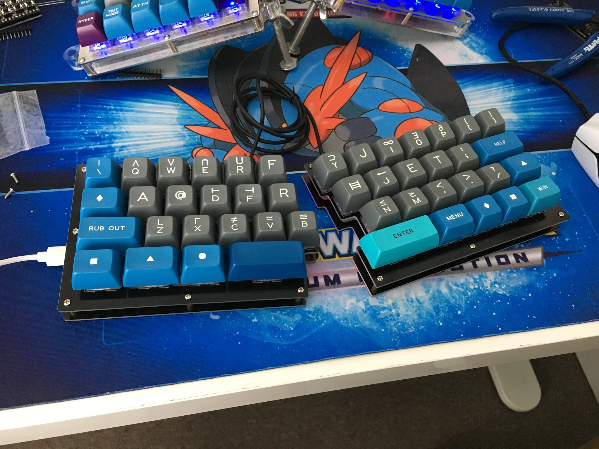

Fourier Keyboard PCB
====================
This is a modified version of the original Fourier keyboard created by [nooges Danny](https://github.com/keebio/fourier) 

Misc Info
---------
- Rev. 1.3 moved controllers to face forward to connect to a PC the same as all keyboards. Moved the LED pins to be unifrom on the inside of each half
- Rev. 1.2 added 1.25u/1u option at the inner two keys of each half, QMK support hasn't been added for those two new keys yet
- Keyboard Layout Editor: [Fourier 1.2 layout](http://www.keyboard-layout-editor.com/#/gists/ec52e429382754843fa2ddb02aecfc4a)

License
-------
These files are released under the MIT License.
